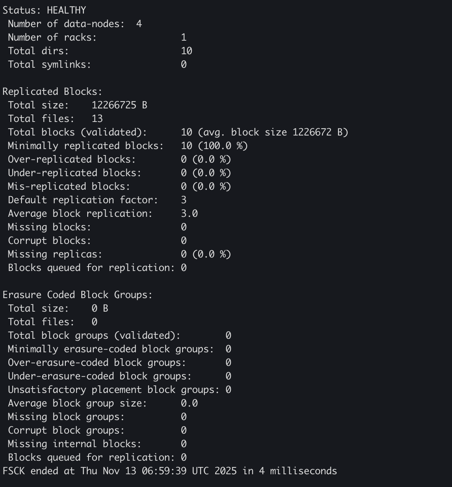

# DIY：基于 MCP 协议集成 Kimi 模型实现图片文字识别

**项目地址**：<https://github.com/ForceInjection/mcp-ocr>

## 引言

在日常技术支持和现场问题排查工作中，笔者经常需要处理各种截图和图片资料。虽然 macOS 的 Preview 应用能够提取简单图片中的文字，但在复杂场景（如代码截图、终端输出、混合排版等）下效果有限。

正是在这样的实际需求驱动下，笔者发现 Kimi 1.5 在图片文字识别方面表现出色，于是萌生了通过 **Model Context Protocol (MCP)** 协议将 Kimi 的 OCR 能力集成到 TRAE 开发环境中的想法，打造一个无缝的图片文字提取体验。

## 项目概述

MCP OCR Server 是一个基于 MCP 1.21.0 协议的开源项目，它通过标准的 MCP 协议提供图片文字提取功能。项目的核心价值在于：

- **标准化接口**：遵循 MCP 协议，与任何支持 MCP 的客户端兼容
- **高性能处理**：基于异步架构，支持并发请求处理
- **简单集成**：无需复杂的 SDK 集成，通过标准协议即可使用

## 技术架构

### 核心组件

```python
from mcp.server.fastmcp import FastMCP
from openai import OpenAI
import base64
import mimetypes

mcp_server = FastMCP("ocr-server")

class KimiFileOCR:
    def __init__(self):
        self.client = OpenAI(
            api_key=get_api_key(),
            base_url=os.environ.get("KIMI_BASE_URL", "https://api.moonshot.cn/v1")
        )
```

### 关键技术栈

1. **MCP 1.21.0**：使用最新的 FastMCP 实现，自动处理能力协商和协议兼容性
2. **OpenAI SDK**：与 Kimi API 集成，提供高质量的 OCR 服务
3. **异步处理**：基于 asyncio 的异步架构，确保高并发性能
4. **双重日志**：同时输出到控制台和文件，便于调试和监控

## 实现细节

### 图片处理流程

```python
def extract_text_from_image(self, file_path: str) -> str:
    # 1. 读取图片文件
    with open(file_path, "rb") as f:
        img_data = f.read()

    # 2. 转换为 Base64
    img_base64 = base64.b64encode(img_data).decode("utf-8")
    mime_type = mimetypes.guess_type(file_path)[0] or "image/png"

    # 3. 调用 Kimi API
    response = self.client.chat.completions.create(
        model="kimi-latest",
        messages=[{
            "role": "user",
            "content": [
                {"type": "image_url", "image_url": {"url": f"data:{mime_type};base64,{img_base64}"}},
                {"type": "text", "text": "请提取图片中的所有文字内容"}
            ]
        }],
        max_tokens=2048,
    )

    return response.choices[0].message.content
```

### 配置管理

项目支持多种配置方式，确保灵活性和安全性：

```python
# 环境变量优先
api_key = os.environ.get("MOONSHOT_API_KEY")

# 配置文件备用
if not api_key and os.path.exists(CREDENTIALS_FILE):
    with open(CREDENTIALS_FILE, "r") as f:
        config = json.load(f)
        api_key = config.get("api_key")
```

## 部署与实践

### 快速开始

```bash
# 1. 安装依赖
pip install -r requirements.txt

# 2. 配置 API 密钥
echo '{"api_key": "sk-your-actual-key"}' > .secrets/credentials.json
```

### 客户端集成

任何支持 MCP 的客户端（如 TRAE、Cursor、Claude 等）都可以通过配置调用 OCR 服务。首先在客户端的 MCP 配置中添加：

```json
// 客户端配置示例 (如 TRAE 的 mcp.json)
{
  "mcpServers": {
    "mcp-ocr": {
      "command": "python",
      "args": ["-m", "src.mcp_ocr_server.mcp_server"],
      "env": {
        "PYTHONPATH": "/path/to/mcp-ocr/src"
      },
      "cwd": "/path/to/mcp-ocr"
    }
  }
}
```

配置完成后，客户端可以通过标准 MCP 协议调用 OCR 服务：

```json
{
  "jsonrpc": "2.0",
  "id": "ocr-request-1",
  "method": "tools/call",
  "params": {
    "name": "extract_text_from_image",
    "arguments": {
      "file_path": "/absolute/path/to/image.png"
    }
  }
}
```

**重要提示**：

- 必须使用绝对路径，相对路径可能无法正确解析
- 确保 Python 环境已安装所有依赖项
- 需要正确设置 `PYTHONPATH` 环境变量指向项目 src 目录

### 使用效果

1. 测试图片：

   

2. 指令：

   ```text
   请使用 MCP 服务提取 2.png 图片中的文字，并保存成文件
   ```

3. 生成文件：

   ```text
   Status: HEALTHY
   Number of data-nodes: 4
   Number of racks: 1
   Total dirs: 10
   Total symlinks: 0

   Replicated Blocks:
   Total size: 12266725 B
   Total files: 13
   Total blocks (validated): 10 (avg. block size 1226672 B)
   Minimally replicated blocks: 10 (100.0 %)
   Over-replicated blocks: 0 (0.0 %)
   Under-replicated blocks: 0 (0.0 %)
   Mis-replicated blocks: 0 (0.0 %)
   Default replication factor: 3
   Average block replication: 3.0
   Missing blocks: 0
   Corrupt blocks: 0
   Missing replicas: 0 (0.0 %)
   Blocks queued for replication: 0

   Erasure Coded Block Groups:
   Total size: 0 B
   Total files: 0
   Total block groups (validated): 0
   Minimally erasure-coded block groups: 0
   Over-erasure-coded block groups: 0
   Under-erasure-coded block groups: 0
   Unsatisfactory placement block groups: 0
   Average block group size: 0.0
   Missing block groups: 0
   Corrupt block groups: 0
   Missing internal blocks: 0
   Blocks queued for replication: 0

   FSCK ended at Thu Nov 13 06:59:39 UTC 2025 in 4 milliseconds
   ```

---

## 性能优化

### 异步处理架构

通过使用 FastMCP 的异步特性，服务器能够同时处理多个 OCR 请求：

```python
@mcp_server.tool()
async def extract_text_from_image(file_path: str) -> str:
    # 异步执行 OCR 处理
    return await asyncio.to_thread(ocr.extract_text_from_image, file_path)
```

### 智能错误处理

完善的错误处理机制确保服务稳定性：

```python
try:
    return ocr.extract_text_from_image(file_path)
except Exception as e:
    logger.error(f"Error extracting text from {file_path}: {e}")
    return f"Error: {str(e)}"
```

---

## 结语

MCP OCR Server 项目成功展示了如何基于 Model Context Protocol (MCP) 标准化协议构建高性能、可扩展的 AI 服务。通过实践验证，MCP 协议在构建现代化 AI 基础设施方面展现出显著优势：统一的接口规范、无缝的工具集成能力以及出色的跨平台兼容性。

该项目不仅提供了一个功能完备的独立 OCR 服务解决方案，更重要的价值在于其作为可复用组件的设计理念。开发者可以轻松将其集成到更大的 AI 应用系统中，快速获得高质量的文本识别能力。代码架构清晰、文档完善，为构建同类 MCP 服务提供了最佳实践参考和扎实的技术基础。
